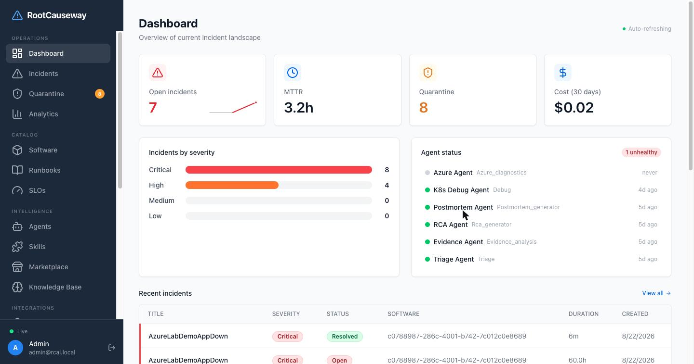
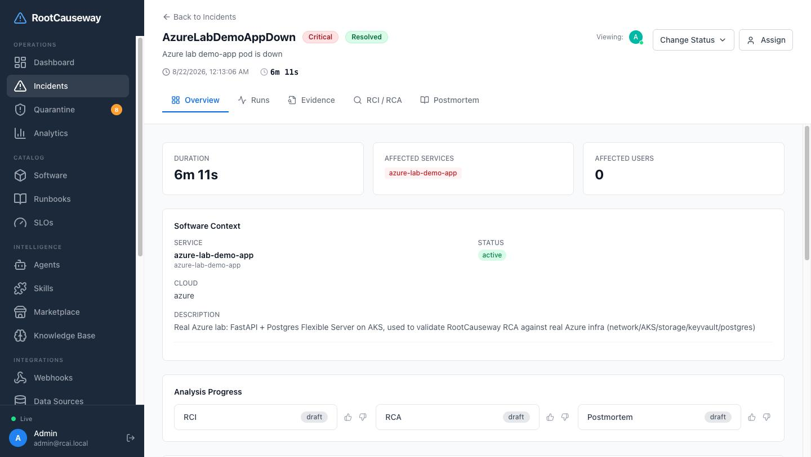
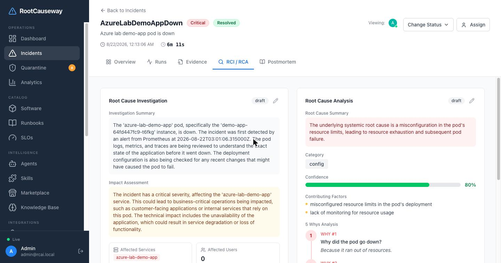
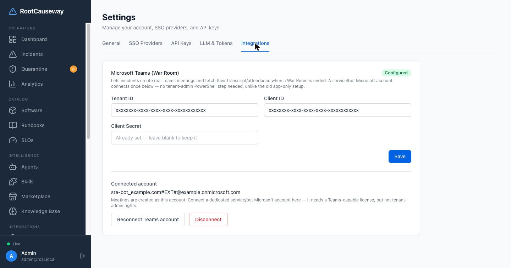
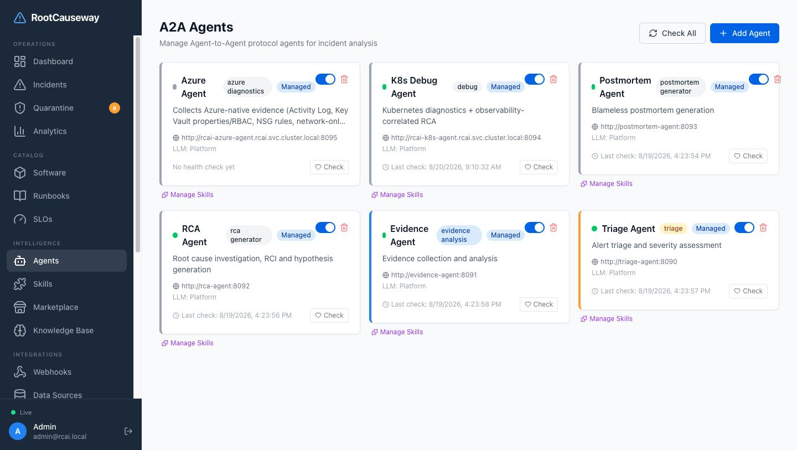
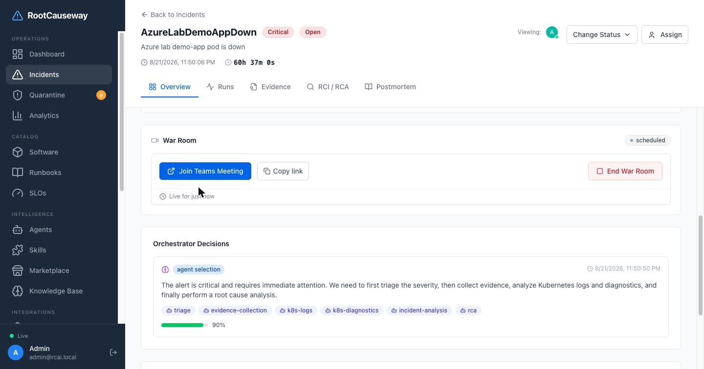
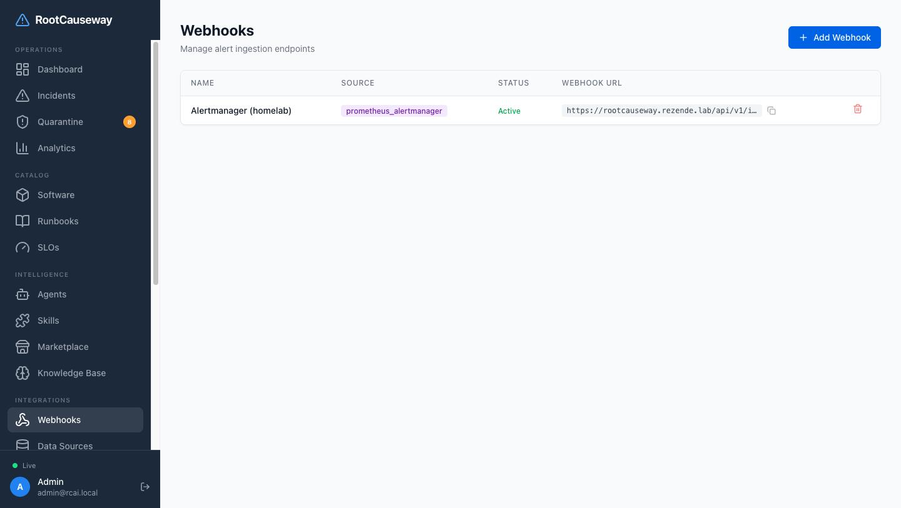

# RootCauseway — Root Cause Analysis Intelligence

A platform that turns operational alerts into a structured, automated incident investigation — triage, evidence collection, root-cause analysis and blameless postmortem, produced by a mesh of specialized AI agents an LLM orchestrator assembles on the fly (not a fixed pipeline).

## Screenshots

| | |
|---|---|
|  |  |
| Dashboard — incident landscape at a glance | Incident — affected-software context, analysis progress |
|  |  |
| Root Cause Analysis — root cause, contributing factors, 5 Whys | Settings > Integrations — Teams connection for War Room |
|  |  |
| A2A agent mesh — health, config and skills per agent | War Room — a real Teams meeting created automatically from an incident |
|  | |
| Webhooks — alert ingestion (Alertmanager, Datadog, etc.) | |

## Highlights

### Multi-agent orchestration, not a fixed pipeline
On `alert.received`, the orchestrator builds the incident's context (affected
software, similar past incidents, evidence already collected) and asks an
LLM, on every iteration, which skill to call next — each result feeds the
next decision. Two incidents of the same alert type can dispatch entirely
different skill sets (a Kubernetes-labeled incident pulls `k8s-debug`/
`k8s-logs`; a cloud-hosted one pulls `azure-*` skills instead). Every agent
(triage, evidence, RCA, postmortem, k8s-debug, azure-diagnostics) is an
independent microservice speaking Google's [A2A protocol](https://google.github.io/A2A/) —
its own Agent Card, discoverable and callable without knowing its internals.
Every call is retried with exponential backoff + jitter and guarded by a
circuit breaker per agent, so one unhealthy agent can't stall an
investigation; a parallel fan-out that partially fails still returns
whatever evidence came back instead of aborting.

### Integrations that actually route somewhere
Alerts come in from Prometheus/Alertmanager, Datadog, Grafana or a generic
webhook, get normalized into one shape, and — once an incident exists —
notifications go back out through Slack, Teams, generic webhooks or
PagerDuty, filtered by severity-aware escalation policies. Every
notification attempt is logged (channel, event type, success/failure), and
Slack notifications for a new incident carry interactive Acknowledge /
View RCA / Resolve buttons wired back to the platform.

### War Room: a real Teams meeting, not a mocked link
One click on an incident creates a genuine Microsoft Teams meeting via
delegated OAuth against a connected service/bot account: the affected
software's stakeholders and SRE team
are resolved and invited automatically, recording/transcription is enabled
on creation, and `war_room_created` fires the same notification path as any
other incident event. Ending the meeting fetches the transcript and
attendance report from Graph and hands them to an LLM for an executive
summary and action items — asynchronously, so the UI never blocks on it.
The meeting's status (`scheduled → active → ended → summarized`) reflects
real activity, not a manual toggle.

See [`FEATURES.md`](FEATURES.md) for the full feature inventory (skills
registry, JIT credential vault, runbooks, knowledge base, analytics, RBAC,
and more) and [`TECHNICAL_SPEC.md`](TECHNICAL_SPEC.md) for the architecture
deep-dive.

## Quick Start

```bash
# Bring up the infrastructure
make up

# Run the test suite
make test

# Local development
make db-up
make dev-backend   # Go API on :8080
make dev-agent     # Python agent service on :8081
make dev-frontend  # React on :5173
```

## Architecture

```
[Datadog/Prometheus/Grafana/OTel]
        ↓ webhook
   [Go Backend API]  ←→  [PostgreSQL]
        ↓ Redis pub/sub
   [Python Agent Service]
        ↓ Redis pub/sub
   [Go Backend API] → updates incident
        ↓
   [React Frontend] → incident cockpit
```

## Contracts

- API: `contracts/openapi/rootcauseway-api.yaml`
- Redis events: `contracts/events/redis-events.yaml`
- DB schema: `contracts/schemas/database.sql`

## License

[MIT](LICENSE)
